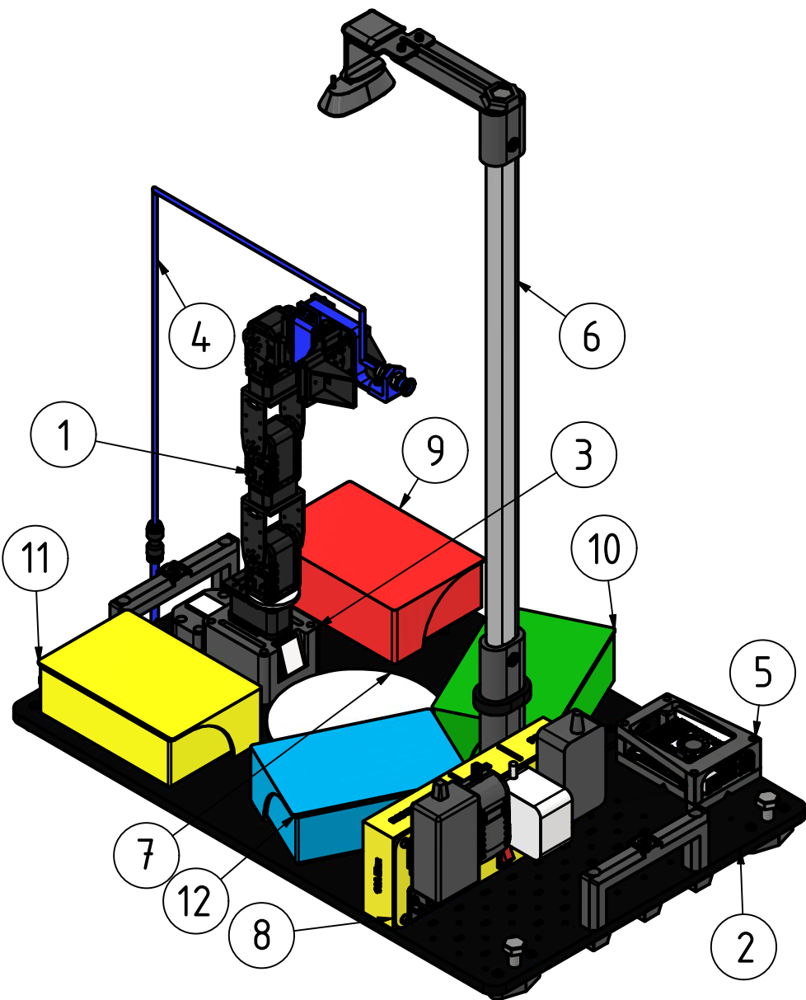
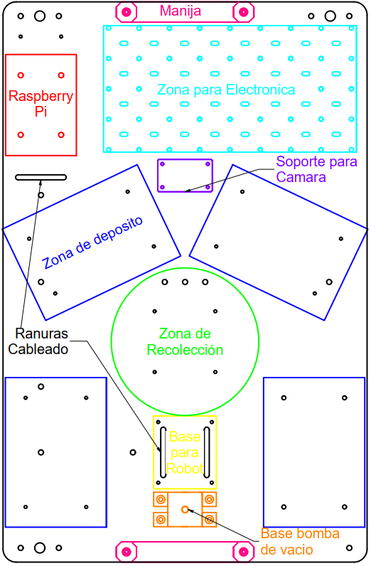

# 3DModels — KIT Phantom Pincher X100

Modelos 3D, documentación y archivos de diseño (Autodesk Inventor) del KIT Phantom Pincher X100, un kit de clasificación de objetos basado en el manipulador PhantomX Pincher.

## Ensamble

El ensamble completo (Autodesk Inventor) se encuentra en [`Kit/ensamblesKit/kitDetallado.iam`](Kit/ensamblesKit/kitDetallado.iam).

## Vista general del kit

Kit de clasificación completo ensamblado. Sus partes son:

1. Manipulador robótico PhantomX Pincher AX-12 con 4 grados de libertad. Carpeta [`Kit/arm/`](Kit/arm), ver [`ensambleBrazo.iam`](Kit/arm/ensambleBrazo.iam).
2. Plataforma base de MDF (554 mm × 360 mm × 9 mm) con acabado negro mate. Carpeta [`Kit/basesParaLosKits/`](Kit/basesParaLosKits), ver [`ensambleBase.iam`](Kit/basesParaLosKits/ensambleBase.iam).
3. Base del manipulador con sistema de identificación numérica. Carpeta [`Kit/arm/`](Kit/arm), ver [`ensambleBaseBrazo.iam`](Kit/arm/ensambleBaseBrazo.iam).
4. Sistema de succión por vacío con gripper intercambiable. Carpeta [`Kit/cases/caseMicroAirPump370A/`](Kit/cases/caseMicroAirPump370A), ver [`ensambleAirpump.iam`](Kit/cases/caseMicroAirPump370A/ensambleAirpump.iam).
5. Controlador Raspberry Pi 5 en carcasa protectora. Carpeta [`Kit/cases/caseRaspberryPi5/turtleCasePi5/`](Kit/cases/caseRaspberryPi5/turtleCasePi5), ver [`raspberryPi5WithCase.iam`](Kit/cases/caseRaspberryPi5/turtleCasePi5/raspberryPi5WithCase.iam).
6. Soporte de cámara con mástil vertical y brazo en voladizo. Carpeta [`Kit/tubosOvaladosNiquel/soporteCamara/`](Kit/tubosOvaladosNiquel/soporteCamara), ver [`ensambleSoporteC270Webcam.iam`](Kit/tubosOvaladosNiquel/soporteCamara/ensambleSoporteC270Webcam.iam).
7. Zona de recolección circular blanca (Ø146 mm). Carpeta [`Kit/zonasDeRecolección/zonaCircular/`](Kit/zonasDeRecolecci%C3%B3n/zonaCircular), ver [`ensambleZonaRecoleccion.iam`](Kit/zonasDeRecolecci%C3%B3n/zonaCircular/ensambleZonaRecoleccion.iam).
8. Multitoma personalizada con control individual de subsistemas. Carpeta [`Kit/cases/multitoma/`](Kit/cases/multitoma), ver [`ensambleMultitoma.iam`](Kit/cases/multitoma/ensambleMultitoma.iam).
9. Caneca de depósito roja. Carpeta [`Kit/Canecas/canecaGrandeConTapaSlide/`](Kit/Canecas/canecaGrandeConTapaSlide), ver [`ensambleCanecaTapaSlide.iam`](Kit/Canecas/canecaGrandeConTapaSlide/ensambleCanecaTapaSlide.iam).
10. Caneca de depósito verde. Carpeta [`Kit/Canecas/canecaGrandeConTapaSlide/`](Kit/Canecas/canecaGrandeConTapaSlide), ver [`ensambleCanecaTapaSlide.iam`](Kit/Canecas/canecaGrandeConTapaSlide/ensambleCanecaTapaSlide.iam).
11. Caneca de depósito azul. Carpeta [`Kit/Canecas/canecaGrandeConTapaSlide/`](Kit/Canecas/canecaGrandeConTapaSlide), ver [`ensambleCanecaTapaSlide.iam`](Kit/Canecas/canecaGrandeConTapaSlide/ensambleCanecaTapaSlide.iam).
12. Caneca de depósito amarilla. Carpeta [`Kit/Canecas/canecaGrandeConTapaSlide/`](Kit/Canecas/canecaGrandeConTapaSlide), ver [`ensambleCanecaTapaSlide.iam`](Kit/Canecas/canecaGrandeConTapaSlide/ensambleCanecaTapaSlide.iam).

Todos los componentes se integran en un contenedor plástico de 600 mm × 400 mm para almacenamiento y transporte.

## Documentación del kit

Toda la información sobre el desarrollo del kit (imágenes del layout, partes, composición del robot, etc.) está en la carpeta [`Documentacion/MONOGRAFIA_KIT`](Documentacion/MONOGRAFIA_KIT). Allí encontrarás:

- [`Monografia_KIT.pdf`](Documentacion/MONOGRAFIA_KIT/Monografia_KIT.pdf): el documento final en PDF.
- [`Trabajo_de_grado/`](Documentacion/MONOGRAFIA_KIT/Trabajo_de_grado): el código fuente en LaTeX junto con las imágenes empleadas para generar el PDF.

## Layout del kit

Las imágenes del layout están en [`06disenoConceptual/img/plataforma/`](Documentacion/MONOGRAFIA_KIT/Trabajo_de_grado/06disenoConceptual/img/plataforma). La versión de referencia es [`layout2.png`](Documentacion/MONOGRAFIA_KIT/Trabajo_de_grado/06disenoConceptual/img/plataforma/layout2.png):

